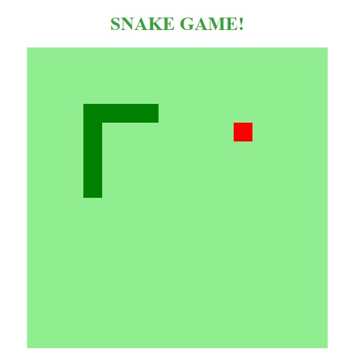

## Recriando jogo da cobrinha

 Jogo simples criado para aprender a trabalhar com canvas.


### Como jogar ?
- Com as setas direcionais do teclado, mova a cobrinha para cima, baixo, direita ou esquerda.
- Tente pegar as 'comidas' (blocos em vermelho) e assim o tamanho da cobra vai aumentando.
- Caso a cobra encoste nela mesma você perde o jogo.


### Controlar a aplicação:
- Para aumentar ou diminuir a velocidade da cobra, altere no javascript o parâmetro 150 que está em milissegundos:

```sh
let jogo = setInterval(iniciarJogo, 150);
```


## Imagem do projeto:
